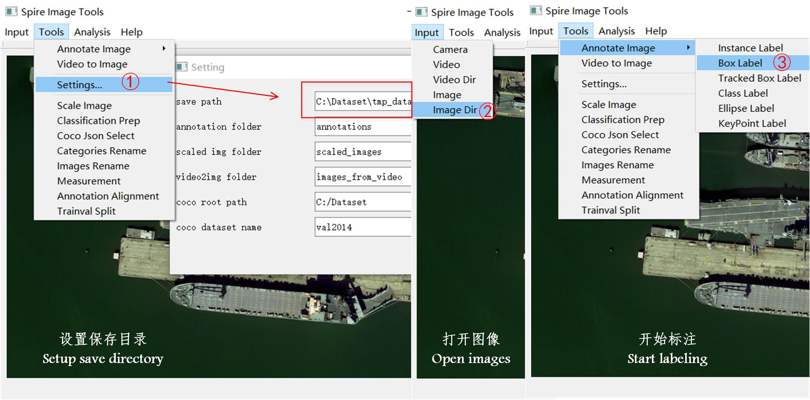
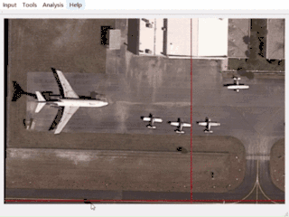
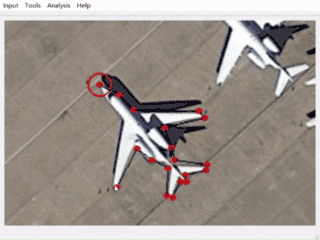
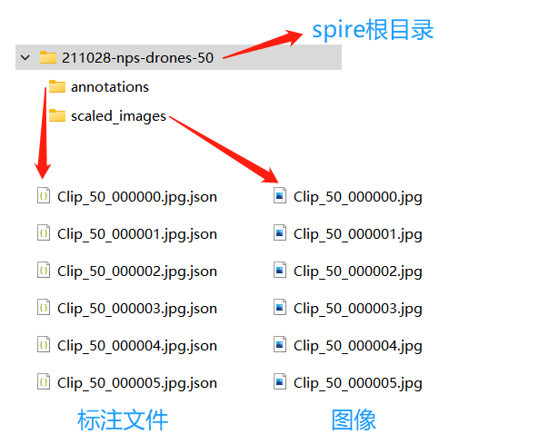
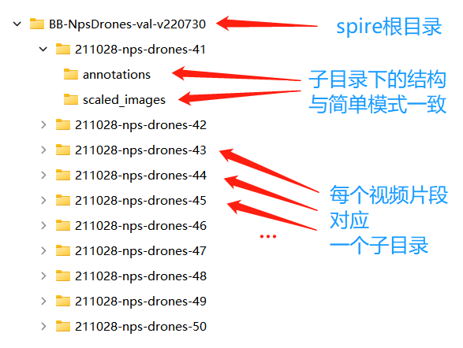
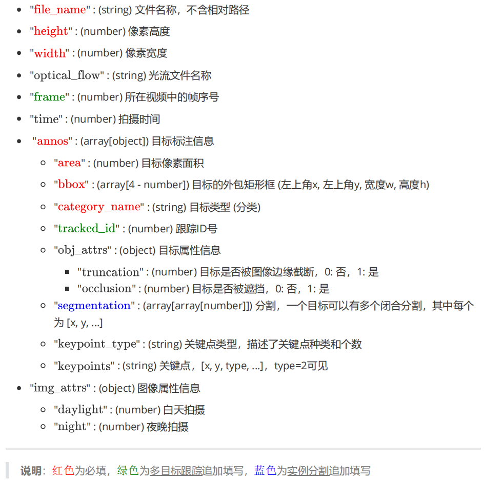
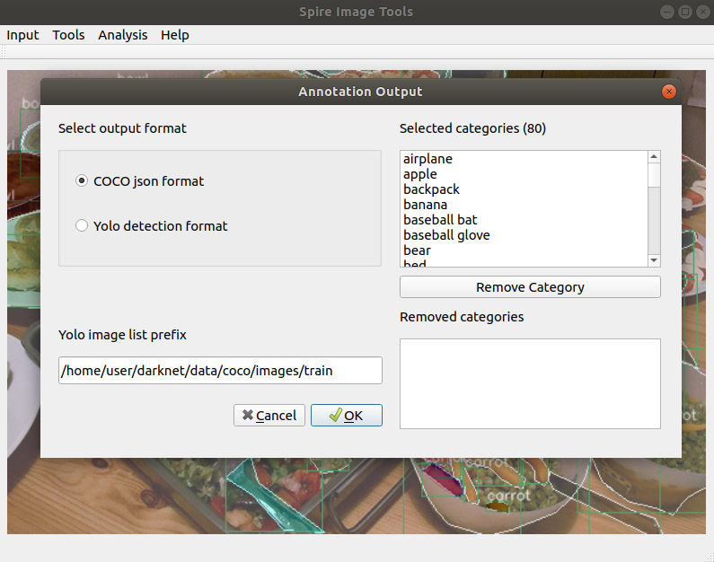
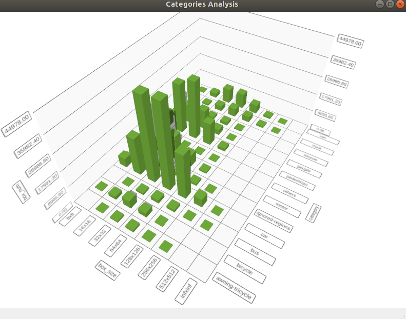

<div align="center">
  
</div>

---

**Spire格式图像/视频数据管理、分析、可视化工具。**

当前版本：**v5.0.9**，下载地址：[**Baidu Pan (Windows x86-64)**](https://pan.baidu.com/s/1zecm66NPvEwD3dC2A3Io-Q?pwd=w40q).

支持[Segment-Anything-Model (SAM)](https://github.com/facebookresearch/segment-anything.git)，本地部署方法如下：

```bash
# 1. 安装SAM（环境：Ubuntu、CUDA、至少12G显存）
pip3 install opencv-python pycocotools matplotlib onnxruntime onnx
git clone https://github.com/facebookresearch/segment-anything.git
cd segment-anything
pip3 install -e .
# 2. 下载模型，转换ONNX
wget https://dl.fbaipublicfiles.com/segment_anything/sam_vit_h_4b8939.pth
python3 scripts/export_onnx_model.py --checkpoint sam_vit_h_4b8939.pth --model-type vit_h --output sam_vit_h_4b8939.onnx --return-single-mask --opset 16
# 3. 拷贝模型到SpireView
cp sam_vit_h_4b8939.pth <path-to-SpireView>/SAM/
cp sam_vit_h_4b8939.onnx <path-to-SpireView>/SAM/
# 4. 运行本地SAM服务
cd <path-to-SpireView>/SAM/
python3 SAM_server.py
# 5. 查看本地IP地址，在Windows版的SpireView中需要输入
ifconfig
```

## 1. 如何使用



支持多种数据标注格式

<tr>
<td></td>
<td></td>
</tr>

## 2. Spire目录结构

- 最简单的目录结构如下：
  
  

- 允许目录结构的**嵌套**使用，以帮助构建大型数据集、视频数据集

- 构建视频数据集时，**每个视频片段**需要放在一个**独立的文件夹**下

- 一个具体的嵌套目录结构如下：



## 3. Spire数据格式（.json）

### 3.1 各字段说明



### 3.2 某个json示例

```json
{
    "annos": [{
        "area": 277,
        "bbox": [552, 251, 24, 17],
        "category_name": "car",
        "segmentation": [
            [561, 253, 552, 263, 558, 266, 564, 268, 573, 266, 576, 260, 576, 254, 572, 251]
        ],
        "keypoint_type": "car_w4_points",
        "keypoints": [228, 208, 2, 376, 365, 2, 390, 309, 2, 277, 190, 2],
        "tracked_id": 1,
        "obj_attrs": {
            "truncation": 0,
            "occlusion": 0
        }
    }],
    "file_name": "IMG_000001.jpg",
    "height": 720,
    "width": 1280,
    "optical_flow": "IMG_000001_FLOW.png",
    "img_attrs": {
        "side-view": 0,
        "bird-view": 1,
        "high-alt": 1,
        "medium-alt": 0,
        "low-alt": 0,
        "daylight": 0,
        "night": 1
    }
}
```

---

- 其中`file_name`、`height`、`width`、`annos`（`bbox`、`category_name`、`area`）为**必填**。其他字段视情况而定

## 4. 在Spire格式标注数据上评估算法性能

参考 [EVALUATION_README.md](utils/evaluate/README.md)

## 5. Spire与MS-COCO格式的相互转换

- MS-COCO格式转化到Spire格式

```bash
python to-spire-annotation/coco_to_spire.py --coco-anno path_to_coco_json --coco-image-dir path_to_coco_image_dir --output-dir spire_annotation_dir
```

- Spire格式转换到MS-COCO格式



## 6. 支持数据分析


